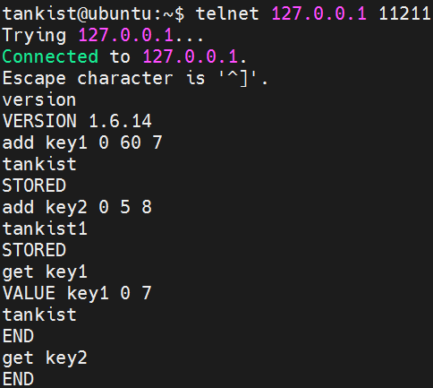
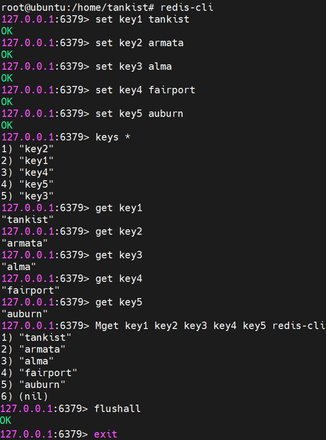
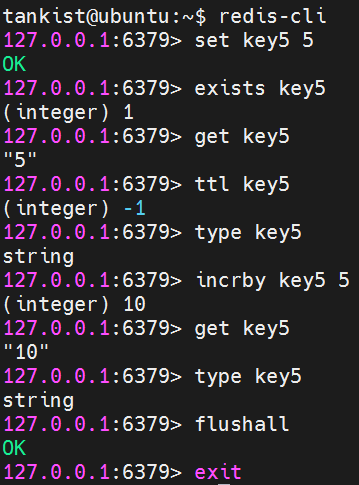

# Домашнее задание к занятию «Кеширование Redis/memcached»

## Задание 1

Кеширование повышает производительность системы.

Кеширование оптимизирует работу системы за счет:

– расположения в быстром кеше данных, к которым выполняются запросы чаще всего;
– экономии ресурсов (обращаемся не к БД, а к кешу);
– сглаживания бустов трафика во время пиковых нагрузок обращений к БД.

Запросы к базам данных могут быть медленными и требовать серьёзных систем-ных ресурсов, так как серверу баз данных, для формирования ответа, нужно выполнять некие вычисления. Если запросы повторяются, кэширование их средствами базы дан-ных поможет уменьшить время её отклика. Кроме того, кэширование полезно в ситуа-циях, когда несколько компьютеров работают с базой данных, выполняя одинаковые запросы.

Кэширование позволяет увеличивать производительность веб-приложений за счёт использования сохранённых ранее данных, вроде ответов на сетевые запросы или результатов вычислений. Благодаря кэшу, при очередном обращении клиента за одни-ми и теми же данными, сервер может обслуживать запросы быстрее.
Некоторые данные могут запрашиваться несколько раз в рамках одной страницы, и чтобы этого избежать, можно использовать дополнительный кэш внутри самого при-ложения.

Кэшировать нужно данные, которые медленно генерируются и часто запраши-ваются:

– результаты запросов к внешним сервисам (RSS, SOAP, REST и т.п.). Результа-ты медленных выборок из базы данных. Сгенерированные html блоки либо целые страницы. Если кэшируем данные, которые могут обновляться, необходимо очищать кэш после каждого обновления;

– списки, которые состоят только из ID пользователей. Для вывода списка от-правляют отдельный запрос для получения данных каждого пользователя. Так мы по-лучим список ID пользователей и для каждого из них получим актуальные данные. При обновлении особенно тяжелых данных следует использовать не сброс кэша, а прямое обновление данных в нем и это позволит избежать дополнительной нагрузки при выполнении тяжелых выборок, когда ключ удаляется. При добавлении новых пользователей, вместо сброса счетчика и повторной выборки, можно просто увеличить значение кэша на единицу.

## Задание 2

Последовательность команд для установки и проверки работы memcached

```
tankist@ubuntu:~$ sudo su
[sudo] password for tankist:
root@ubuntu:/home/tankist# apt-get update -y
root@ubuntu:/home/tankist# apt-get install memcached -y
root@ubuntu:/home/tankist# memcached -V
root@ubuntu:/home/tankist# netstat -tap | grep memcached
root@ubuntu:/home/tankist# systemctl status memcached
```

Cкриншот, демонстрирующий правильность установки и работы memcached представлен на рисунке 2.1

</br>
Рисунок 2.1. Cкриншот, демонстрирующий правильность установки и работы memcached.

## Задание 3

Добавим два ключа: один с TTL 60 (минута), другой с TTL 5 секунд.

```
tankist@ubuntu:~$ telnet 127.0.0.1 11211
version
add key1 0 60 7
tankist
add key2 0 5 8
tankist1
get key1
get key2
```
Разница в TTL двух ключей продемонстрирована на рисунке ниже

</br>
Рисунок 3.1 разница хранения ключей с разным TTL.


## Задание 4

Запись данных в Redis и их получение.

Последовательность команд:

```
tankist@ubuntu:~$ sudo su
root@ubuntu:/home/tankist# apt-get install -y redis
root@ubuntu:/home/tankist# systemctl status redis
root@ubuntu:/home/tankist# redis-cli
127.0.0.1:6379> set key1 tankist
127.0.0.1:6379> set key2 armata
127.0.0.1:6379> set key3 alma
127.0.0.1:6379> set key4 fairport
127.0.0.1:6379> set key5 auburn
127.0.0.1:6379> keys *
127.0.0.1:6379> get key1
127.0.0.1:6379> get key2
127.0.0.1:6379> get key3
127.0.0.1:6379> get key4
127.0.0.1:6379> get key5
127.0.0.1:6379> Mget key1 key2 key3 key4 key5 redis-cli
127.0.0.1:6379> flushall
127.0.0.1:6379> exit
```

Запись и получение данных представлены на рисунке ниже.

</br>
Рисунок 4.1 Запись данных в Redis и их получение.

## Задание 5

Добавление ключа с целочисленным значением и изменение его значения

```
tankist@ubuntu:~$ redis-cli
127.0.0.1:6379> set key5 5
127.0.0.1:6379> exists key5
127.0.0.1:6379> get key5
127.0.0.1:6379> ttl key5
127.0.0.1:6379> type key5
127.0.0.1:6379> incrby key5 5
127.0.0.1:6379> get key5
127.0.0.1:6379> type key5
127.0.0.1:6379> flushall
127.0.0.1:6379> exit
```

Выполнение команд представлено на рисунке ниже.

</br>
Рисунок 5.1 Создание ключа со значением int и изменение данного значения.
